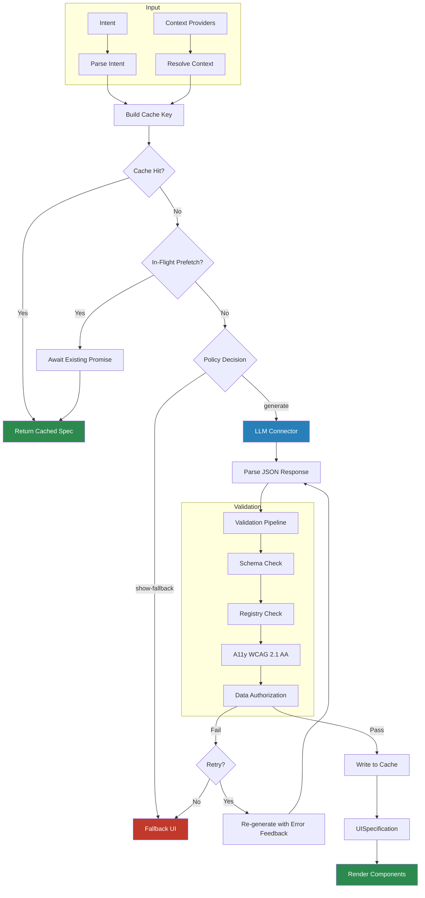
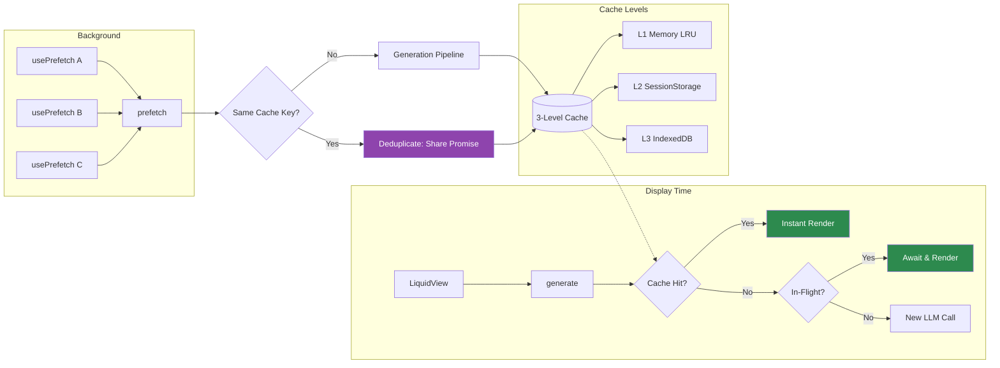
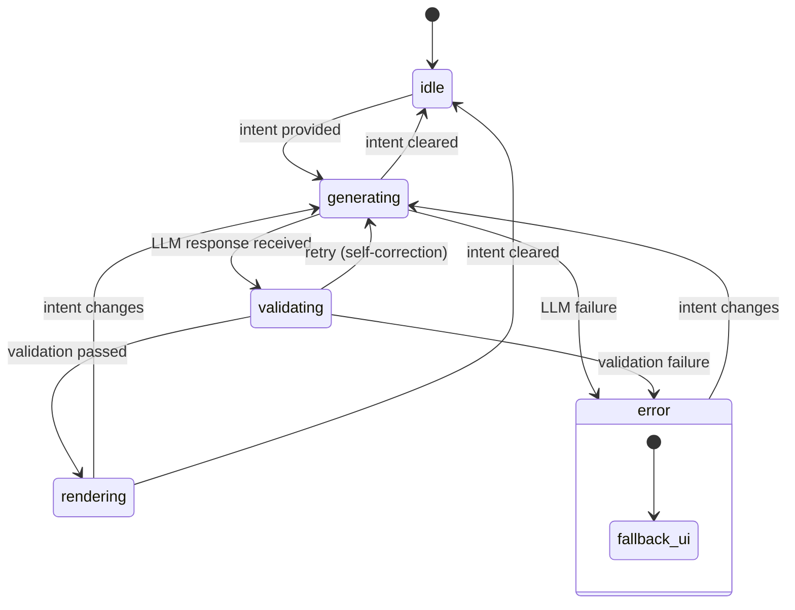

# Flui — The Liquid UI Framework

> *React and Vue solved data reactivity. Flui solves **intent reactivity** — the UI reacts not only to data, but to context, intention, and intelligence.*

Flui is an open-source, framework-agnostic, LLM-native frontend framework that enables developers to build **liquid interfaces** — user interfaces that generate and adapt themselves in real-time based on user intent, context, and constraints.

Flui does not replace React, Vue, or Angular — it **augments** them. A developer can make a single component "liquid" while the rest of their application remains unchanged. The framework is LLM-agnostic (OpenAI, Anthropic, Ollama, sovereign models), and designed from the ground up for production environments where security, accessibility, and cost control are non-negotiable.

```
(intent, context, constraints) → generate → validate → render
```

## Features

- **Intent-first** — UI driven by what the user wants to accomplish, not pre-built templates
- **Context-aware** — adapts to user role, expertise level, device type, and workflow phase
- **Constraint-driven** — every generated UI validated against formal rules (a11y, compliance, security)
- **Progressive adoption** — add one liquid component at a time, no big-bang migration
- **LLM-agnostic** — works with any provider (OpenAI, Anthropic, Mistral, Ollama, custom)
- **Secure by design** — the LLM generates declarative JSON specs, never executable code
- **Observable** — every generation decision is traced, replayable, and auditable
- **Prefetchable** — decouple LLM generation from rendering with background prefetch for instant navigation
- **Production-ready** — 3-level caching, budget enforcement, circuit breaker, concurrency control

## Packages

| Package | Description |
|---------|-------------|
| `@flui/core` | Core generation engine, validation pipeline, caching, cost control |
| `@flui/react` | React adapter — `<LiquidView>`, `<FluiProvider>`, `usePrefetch`, `<DebugOverlay>` |
| `@flui/openai` | OpenAI GPT connector |
| `@flui/anthropic` | Anthropic Claude connector |
| `@flui/testing` | MockConnector, spec builders, render helpers for tests |
| [`examples/showcase`](./examples/showcase/) | Interactive demo app — 5 scenarios, 9 components, zero-config |

## Quick Start

### Installation

```bash
# Core + React adapter
pnpm add @flui/core @flui/react

# Choose your LLM connector
pnpm add @flui/openai      # for OpenAI
pnpm add @flui/anthropic   # for Anthropic Claude
```

### Setup

```typescript
import { createFlui } from '@flui/core';
import { createOpenAIConnector } from '@flui/openai';
import { z } from 'zod';

const flui = createFlui({
  connector: createOpenAIConnector({ apiKey: process.env.OPENAI_API_KEY }),
  generation: { model: 'gpt-4o' },
  budget: { sessionBudget: 1.00 },
});

// Register your components
flui.registry.register({
  name: 'Button',
  category: 'input',
  description: 'A clickable button',
  accepts: z.object({ label: z.string() }),
  component: MyButtonComponent,
});
```

### Render a Liquid View

```tsx
import { FluiProvider, LiquidView } from '@flui/react';

function App() {
  return (
    <FluiProvider instance={flui}>
      <LiquidView
        intent="Show team performance for this month"
        fallback={<StaticDashboard />}
        transition={{ durationMs: 200 }}
      />
    </FluiProvider>
  );
}
```

The `<LiquidView>` component handles the full lifecycle: intent parsing, context resolution, LLM generation, validation, and rendering — with a mandatory fallback for graceful degradation.

### Prefetch for Instant Navigation

Trigger LLM generation in the background before the UI is needed — the result is cached and served instantly when `<LiquidView>` mounts:

```tsx
import { FluiProvider, LiquidView, usePrefetch } from '@flui/react';

function App() {
  // Start background generation as soon as the component mounts
  const { status } = usePrefetch({ intent: 'Show pricing plans' });

  return (
    <FluiProvider instance={flui}>
      {/* When the user navigates here, the spec is already cached → instant render */}
      <LiquidView
        intent="Show pricing plans"
        fallback={<LoadingSkeleton />}
      />
      <p>Prefetch status: {status}</p> {/* idle → in-flight → cached */}
    </FluiProvider>
  );
}
```

Imperative API for non-React contexts:

```typescript
// Prefetch a single intent
await flui.prefetch({ intent: 'Show pricing plans' });

// Prefetch multiple intents with concurrency control
await flui.prefetchMany({
  inputs: [
    { intent: 'Show pricing plans' },
    { intent: 'Show documentation' },
  ],
  concurrency: 2,
});

// Check prefetch status
const status = await flui.getPrefetchStatus({ intent: 'Show pricing plans' });
// 'idle' | 'in-flight' | 'cached' | 'failed'
```

Prefetches are deduplicated — concurrent calls for the same intent share a single LLM request. `generate()` automatically awaits in-flight prefetches instead of starting duplicate requests.

### Custom LLM Connector

Bring any LLM by implementing the `LLMConnector` interface:

```typescript
import type { LLMConnector } from '@flui/core';

const myConnector: LLMConnector = {
  async generate(prompt, options, signal) {
    const response = await callMyLLM(prompt);
    return ok({ content: response, model: 'my-model', usage: { ... } });
  }
};
```

## Architecture

Flui is built on three pillars:

**Context Engine** — Collects identity (role, permissions, expertise), environment (device, viewport, connectivity), and custom signals via pluggable providers.

**Validation Pipeline** — Every generated spec passes through: Schema Validation → Component Registry Check → Accessibility (WCAG 2.1 AA) → Data Authorization → custom validators. Failures trigger self-correction retries or graceful degradation.

**Observability** — Structured traces for every generation (intent, context, component selection, validation result, latency). Pluggable transports, PII redaction, and a React `<DebugOverlay>` for development.

### Generation Pipeline



### Prefetch & Cache Flow



### LiquidView Lifecycle



Each state is a discriminated union — strict, type-safe, no states skipped.

### UISpecification

The LLM generates a declarative JSON spec — never executable code:

```typescript
interface UISpecification {
  version: string;
  components: ComponentSpec[];     // { id, componentType, props, children? }
  layout: LayoutSpec;              // { type: 'stack'|'grid'|'flex'|'absolute', ... }
  interactions: InteractionSpec[]; // { source, target, event, dataMapping? }
  metadata: UISpecificationMetadata;
}
```

### Additional Subsystems

- **3-level cache** — L1 in-memory LRU, L2 session storage, L3 IndexedDB (optional via `idb-keyval`)
- **Cost manager** — pre-call estimation, post-call recording, session/daily budget enforcement
- **Circuit breaker** — CLOSED → OPEN → HALF-OPEN pattern with configurable thresholds
- **Policy engine** — decides serve-from-cache vs generate vs show-fallback
- **Prefetch & in-flight deduplication** — background generation with `prefetch()`, shared promise registry prevents duplicate LLM calls
- **Streaming** — `StreamingLLMConnector` with `AsyncIterable<GenerationChunk>` for progressive rendering

## Error Handling

All operations use a `Result<T>` pattern — no throwing in normal control flow:

```typescript
import { ok, err, isOk } from '@flui/core';

const result = await flui.generate({ intent: 'Show a button' });
if (isOk(result)) {
  console.log(result.value); // UISpecification
} else {
  console.error(result.error); // FluiError with typed code
}
```

33 typed error codes (`FLUI_E001`–`FLUI_E033`) covering config, validation, connector, cache, budget, concurrency, and observability errors.

## Testing

```bash
# Install testing utilities as a dev dependency
pnpm add -D @flui/testing
```

```typescript
import { createMockConnector, renderLiquidView, waitForGeneration } from '@flui/testing';
import { createMinimalSpec } from '@flui/testing';

const mock = createMockConnector();
mock.enqueue({
  content: JSON.stringify(createMinimalSpec()),
  model: 'mock',
  usage: { promptTokens: 10, completionTokens: 20, totalTokens: 30 },
});

const { states } = renderLiquidView({ connector: mock, intent: 'Show a button' });
const spec = await waitForGeneration(states);
expect(spec.components[0].componentType).toBe('Text');
```

## Examples

### Showcase App

A runnable demo application that demonstrates flui's key features in a single interactive experience. Located at [`examples/showcase/`](./examples/showcase/).

**Works out of the box with zero API key** — uses `MockConnector` from `@flui/testing` by default. Optionally set `VITE_OPENAI_API_KEY` for live LLM mode.

```bash
# Start the showcase app
pnpm --filter @flui/showcase dev
```

Open `http://localhost:5173` and explore five scenarios:

| Scenario | Demonstrates |
|----------|-------------|
| **Hello Liquid World** | Basic generation from a single intent — `createFlui`, `<LiquidView>`, crossfade transition |
| **Context-Aware Dashboard** | Context engine with identity and environment providers driving MetricCard layout |
| **Interactive Form** | `InteractionSpec` data wiring between Input, Select, and DataTable |
| **Role-Adaptive UI** | Switching user roles (admin / editor / viewer) re-triggers generation with different specs |
| **Prefetch: Instant Navigation** | Side-by-side comparison of standard loading delay vs. background prefetch for instant tab switching |

The app includes:

- **9 registered components** — Heading, Text, Button, Card, Input, Select, DataTable, MetricCard, StatusBadge
- **Live metrics bar** — cost and cache stats from `flui.getMetrics()`
- **Debug overlay** — toggle with `Ctrl+Shift+D` to inspect the generated spec and trace

## Development

```bash
# Install dependencies
pnpm install

# Build all packages
pnpm build

# Run tests
pnpm test

# Lint and format
pnpm lint
pnpm format

# Check bundle sizes
pnpm size
```

### Tech Stack

| Layer | Technology |
|-------|-----------|
| Language | TypeScript 5.8 (strict mode) |
| Build | tsup (per-package), Turborepo (orchestration) |
| Validation | Zod 4 |
| Linting | Biome |
| Testing | Vitest, @testing-library/react |
| Bundle analysis | size-limit |
| Releases | Changesets |

## License

[MIT](./LICENSE) — Copyright (c) 2026 flui contributors
